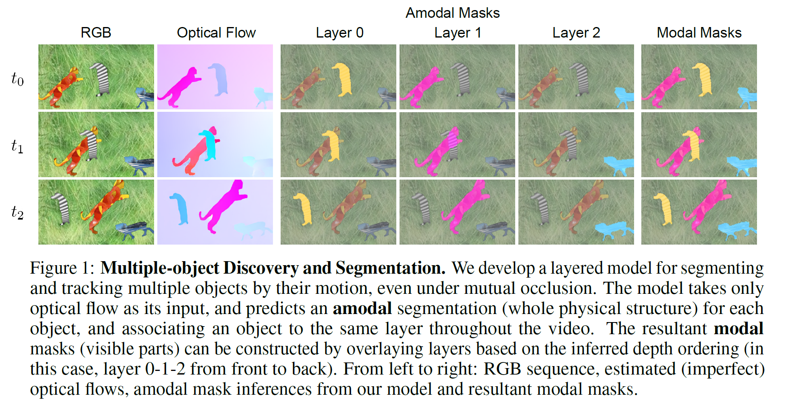

# Segmenting Moving Objects via an Object-Centric Layered Representation
Junyu Xie, Weidi Xie, Andrew Zisserman

Visual Geometry Group, Department of Engineering Science, University of Oxford

In *NeurIPS*, 2022.

[[arXiv]](https://arxiv.org/abs/2207.02206)
[[PDF]](https://www.robots.ox.ac.uk/~vgg/publications/2022/Xie22/xie22.pdf)
[[Project Page]](https://www.robots.ox.ac.uk/~vgg/research/oclr/)
[[Poster]](https://www.robots.ox.ac.uk/~vgg/publications/2022/Xie22/poster.pdf)

<p align="center">
  
</p>

## Requirements
```python=3.8.8```,
```pytorch=1.9.1```,
```Pillow```,
```opencv```,
```einops``` (for tensor manipulation),
```tensorboardX``` (for data logging)


## Dataset preparation

* DAVIS2016 can be used directly after download. 
* For **DAVIS2017-motion**, RGB sequences are the same as those within the DAVIS2017 dataset. The curated annotations can be downloaded from [here](https://drive.google.com/drive/folders/16zqUO1WuAp8Am4Giitc9hn2rMao6x_MA?usp=sharing).
* Other datasets such as SegTrackv2, FBMS-59 and MoCA_filter are required to be preprocessed. We follow the same preprocessing protocol in [motiongrouping](https://github.com/charigyang/motiongrouping).
* **Synthetic datasets (Syn-Train and Syn-Val)** can be downloaded from [here](https://drive.google.com/drive/folders/1tmDq_vG_BvY5po40Ux5OBds1avUM_CbR?usp=sharing). (Modal annotations are not provided, as they can be generated from amodal annotations during dataloading).

Optical flows are estimated by [RAFT](https://github.com/princeton-vl/RAFT) method. Flow estimation codes are also provided in ```flow``` folder.

Once finished, in ```config.py```, modify dataset paths in ```setup_dataset``` and set corresponding logging paths in ```setup_path```.

#### To setup your own data: 
* Add you own dataset information in ```setup_dataset``` in  ```config.py``` .
* Add you dataset name to the choices in ```parser.add_argument('--dataset')``` in ```train.py``` and ```eval.py```
* Add colour palette information for input/output annotations to ```data/colour_palette.json```

## Training
```
python train.py --queries 3 --gaps 1,-1 --batch_size 2 --frames 30 --dataset Syn
```
The flow-only OCLR model pretrained on our synthetic dataset (Syn-train) can be downloaded from [here](https://drive.google.com/drive/folders/1woNkxW4zf648PixXL6EyRmm5sK4gXKZ0?usp=sharing).


## Inference
```
python eval.py --queries 3 --gaps 1,-1 --batch_size 1 --frames 30 --dataset DAVIS17m --resume_path /path/to/ckpt --save_path /path/to/savepath
```
where ```--resume_path``` indicates the checkpoint path, and ```--save_path``` corresponds to the saving path of segmentation results.

Our segmentation results on several datasets (DAVIS2016, DAVIS2017-motion, SegTrackv2, FBMS-59, MoCA) can be also found [here](https://drive.google.com/drive/folders/1W_u4z8DmLFmv4VVL982f5VymNc4tGQq-?usp=sharing).


#### Evaluation benchmarks:
* For DAVIS2016, use the [DAVIS2016 official evaluator](https://github.com/fperazzi/davis).
* For DAVIS2017-motion, once our curated annotations are downloaded from [here](https://drive.google.com/drive/folders/16zqUO1WuAp8Am4Giitc9hn2rMao6x_MA?usp=sharing), simply replace ```Annotations_unsupervised``` folder in the DAVIS2017 dataset. Then, [DAVIS2017 official evaluator](https://github.com/fperazzi/davis-2017) can be used to evaluate the **unsupervised** VOS performance.
* For MoCA, use the evaluator provided in [motiongrouping](https://github.com/charigyang/motiongrouping).

## Test-time adaptation
The test-time adaptation process refines flow-predicted masks by a RGB-based mask propagation process based on DINO features. More information can be found in ```dino``` folder.


## Citation
If you find the code helpful in your research, please consider citing our work:
```
@inproceedings{xie2022segmenting,
    title     = {Segmenting Moving Objects via an Object-Centric Layered Representation}, 
    author    = {Junyu Xie and Weidi Xie and Andrew Zisserman},
    booktitle = {Advances in Neural Information Processing Systems},
    year      = {2022}
}
```


 

 
